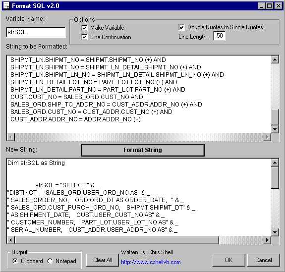



## Format SQL \- v2\.0

### Description

Version 2.0 Bigger and Better! I had posted v1.0 yesterday but found some big improvments. The formater is now smarter when it comes to SQL. It knows where the SQL clauses are! Formats SQL Statements for you so they can be inserted into your code! Saves tons on time in development!

-

You create your SQL in whatever program is easy for you (i.e. Access, SQLPlus, TOAD, Notepad).

-

Then you launch FormatSQL

-

Then paste your SQL into the 'String to be Formatted' section.

-

Then choose your options and click on 'Format String'!

-

Now you select your output Clipboard or Notepad and hit 'OK'

-

The results are now ready in your desired location.

-

This program saves tons of time. I wrote out of a huge need of mine. I was sick of formatting SQL in the code window, it was tedious and redundant! I saw this program in another suite of tools that costs $299. Now you can have it for FREE!

-

Please Vote me if you like!
 
### More Info
 

             |
---                |---
**Submitted On**   |2001-04-26 16:00:28
**By**             |[Chris Shell](https://github.com/Planet-Source-Code/PSCIndex/blob/master/ByAuthor/chris-shell.md)
**Level**          |Advanced
**User Rating**    |4.8 (38 globes from 8 users)
**Compatibility**  |VB 6\.0
**Category**       |[Complete Applications](https://github.com/Planet-Source-Code/PSCIndex/blob/master/ByCategory/complete-applications__1-27.md)
**World**          |[Visual Basic](https://github.com/Planet-Source-Code/PSCIndex/blob/master/ByWorld/visual-basic.md)
**Archive File**   |[Format SQL188454262001\.zip](https://github.com/Planet-Source-Code/chris-shell-format-sql-v2-0__1-22718/archive/master.zip)

